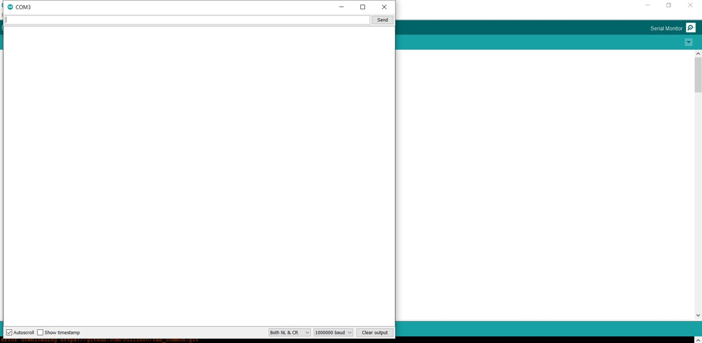
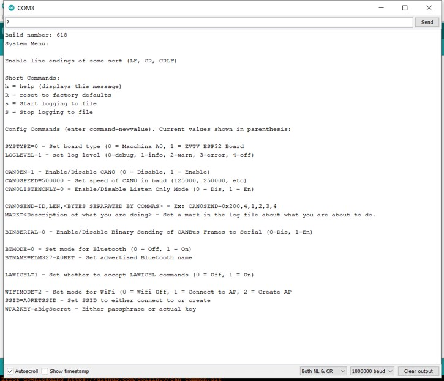

# Firmware Reference

## Introduction to A0RET

#### What is A0RET?

A0RET is the name of the firmware that comes pre-loaded on your new Macchina A0. A0RET stands for A0 Reverse Engineering Tool and provides two primary functionalities\*: ELM327 emulation for use with apps like Torque, and Wi-Fi based connection to SavvyCAN.

_\*These functionalities are current as of version 0.1, however future versions may have expanded features._

#### ELM327 Emulation, Explained Extra Efficiently 

Why would you want to emulate an ELM327 device? ELM327 is a closed-source black box interpreter chip \(a PIC with some firmware\) and you'd much rather know exactly what is being sent to and from your car, right?

Another answer is that now you can take advantage of the numerous existing, \(semi\) working and tested applications out there for every platform.

#### SavvyCAN 

is a CAN bus reverse engineering and capture tool. 

## LED Color Codes

* RED - Not connected \(In WIFIMODE=2 you are creating an AP with the A0, so it will go green immediately because you're the AP\)
* Green - Ready to connect to application 
* Blue - Connected to application
* Purple - Update mode 

## Smartphone apps 

A0 should be compatible with any ELM327 based app. 

**Android** -  Torque Lite can be found at the link below:



Search the google play store for more options. 

**iOS** - Software version 14 of iOS breaks support for A0. We are working to regain iOS support. For those interested in testing on 13 or older make sure your app settings are: 

* Connection = WiFi
* IP address = 192.168.4.1
* OBD2 adapter port = 1000

#### Other ELM based software



## System Menu

**Options:** 

Short Commands: h = help \(displays this message\) R = reset to factory defaults s = Start logging to file S = Stop logging to file

Config Commands \(enter command=newvalue\). Current values shown in parenthesis:

SYSTYPE=0 - Set board type \(0 = Macchina A0, 1 = EVTV ESP32 Board LOGLEVEL=1 - set log level \(0=debug, 1=info, 2=warn, 3=error, 4=off\)

CAN0EN=1 - Enable/Disable CAN0 \(0 = Disable, 1 = Enable\) CAN0SPEED=500000 - Set speed of CAN0 in baud \(125000, 250000, etc\) CAN0LISTENONLY=0 - Enable/Disable Listen Only Mode \(0 = Dis, 1 = En\)

CAN0SEND=ID,LEN, - Ex: CAN0SEND=0x200,4,1,2,3,4 MARK= - Set a mark in the log file about what you are about to do.

BINSERIAL=0 - Enable/Disable Binary Sending of CANBus Frames to Serial \(0=Dis, 1=En\)

BTMODE=0 - Set mode for Bluetooth \(0 = Off, 1 = On\) BTNAME=ELM327-A0RET - Set advertised Bluetooth name

LAWICEL=1 - Set whether to accept LAWICEL commands \(0 = Off, 1 = On\)

WIFIMODE=2 - Set mode for WiFi \(0 = Wifi Off, 1 = Connect to AP, 2 = Create AP SSID=A0RETSSID - Set SSID to either connect to or create WPA2KEY=aBigSecret - Either passphrase or actual key

### To enter A0 built in options menu

Get set up: 

1. If you don't already have Arduino installed download and install Arduino. 
2. Connect A0 to your computer with a USB cable \(A0's LED should turn green\) 
3. Open Arduino 
4. Select the port \(port numbers change frequently, your port number will likely be different than the one pictured\)  


Open an Arduino Serial Monitor: \(button in the upper right corner\) 



Set your baud rate to 1000000 if it is not already 

Send a question mark \(?\) to open the Menu 



On the left is the current state. On the right in parentheses are the options. For example BTmode=0 means Bluetooth is currently off. Send BTmode=1 in the top line to turn it on. Send another ? to make sure the change was made. 


## Re-Flashing A0RET 

A0RET is the firmware shipped pre-loaded on A0, follow these steps to return it back to that state. 

1. Download the below Zip file
2. Extract the files
3. Plug A0 into your computer via USB 
4. Run the correct file for your computer
   1. PC - Updater.bat
   2. MAC - Updater.sh
   3. Linux - Updater.command
5. A green light should appear on the A0



To compile your self find everything for A0RET\(aka esp32RET\) here: 




## A0RET Alternative \(Arduino\) 


This removes the preinstalled A0RET


#### Using Arduino to install your own sketch

The following steps are needed to get started programming on the Macchina A0 with the Arduino IDE:

1. Install the Arduino Desktop IDE
2. Install the Macchina A0 Board Configuration
3. Build and upload a sketch

#### Arduino Desktop IDE

Follow the official installation instructions for your operating system then return here to continue with Macchina A0 specific setup.

* [Windows](https://www.arduino.cc/en/Guide/Windows)
* [macOS](https://www.arduino.cc/en/Guide/MacOSX)
* [Linux](https://www.arduino.cc/en/Guide/Linux)

#### Board Definition


Before using Arduino IDE with A0 for the first time, you must follow the instructions in the link below to add ESP32 board definitions.




#### Flashing A0

1. Connect A0 to your computer via a micro USB cable
2. Select "ESP32 Dev Module" as board type.
3. Upload a sketch. An easy sketch to adapt is the "Blink" sketch found in File&gt;Examples&gt;Basics&gt;Blink.
4. Change the three instances of "LED\_BUILTIN" to "13": 

   ```cpp
    void setup() {
    // initialize digital pin LED_BUILTIN as an output.
    pinMode(13, OUTPUT);
    }

    // the loop function runs over and over again forever
    void loop() {
    digitalWrite(13, HIGH);   // turn the LED on (HIGH is the voltage level)
    delay(1000);                       // wait for a second
    digitalWrite(13, LOW);    // turn the LED off by making the voltage LOW
    delay(1000);                       // wait for a second
    }
   ```

5. Press upload and the LED will blink every 1 second! 💡

