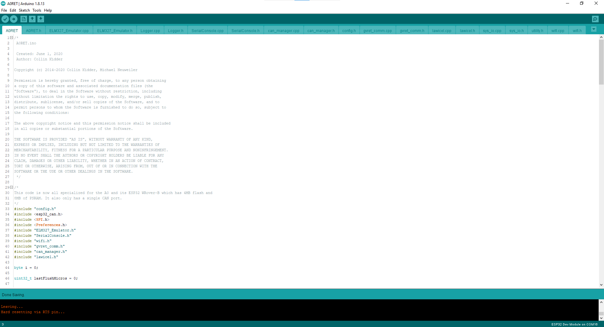
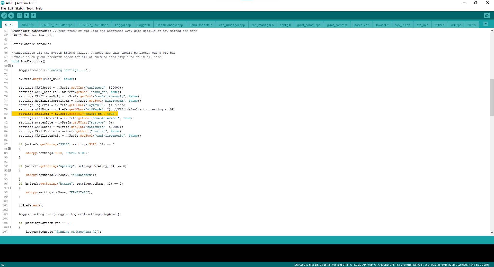
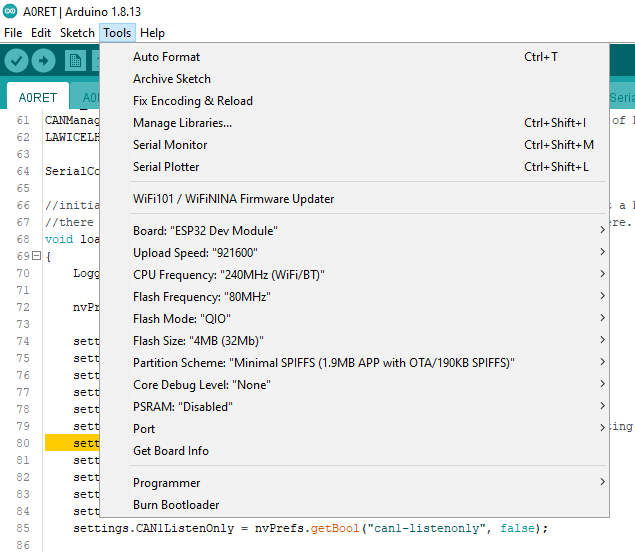
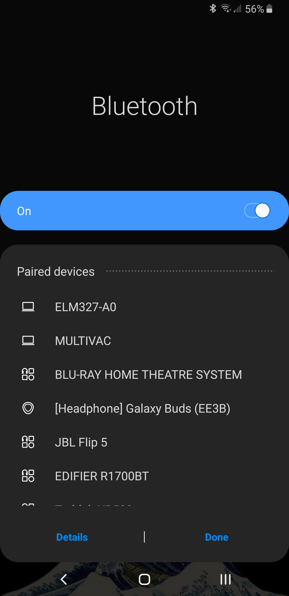
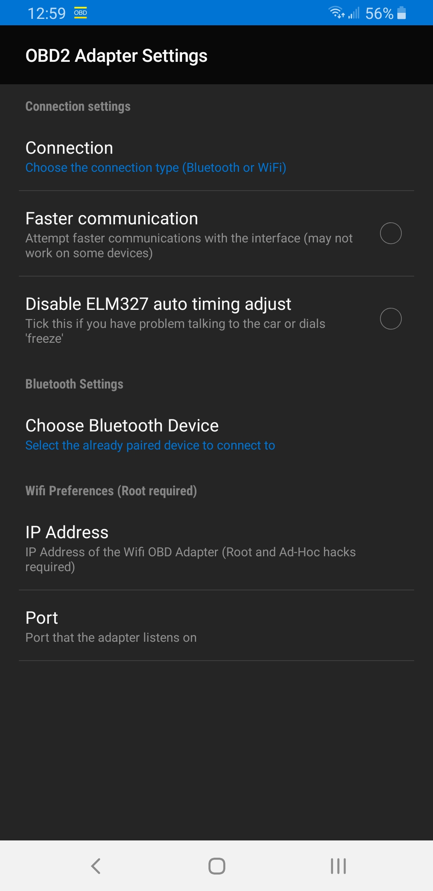

# Getting Started with A0

#### What is A0RET?

_Describe what A0RET does._ 

_Describe ELM327 \(use info from below\)_

_Make note to mention that this is for version 0.1, next version \(0.2\) will have different features._

#### Torque Download

Torque Lite for Android can be found [HERE](https://play.google.com/store/apps/details?id=org.prowl.torquefree&hl=en_US)

Torque is currently only available on Android, however many ELM327 compatible apps exist for iOS.

_\*\*Mention other iOS and other Android ELM327 applications\*_

#### Sketch

Find the A0RET repo at [THIS LINK](https://github.com/collin80/A0RET), download the entire repo as a .zip and extract to a folder called A0RET. Open A0RET.ino with Arduino IDE. 

#### Enable Bluetooth

On line 80 of A0RET.ino, change false to true to enable Bluetooth by default \(for connecting with Torque\).

#### Upload Settings

Ensure your settings match those shown below before uploading. \(These should all be correct by default except for Partition Scheme\)

#### Connect via Bluetooth

Using your phone's Bluetooth settings, connect to ELM327-A0.

#### Configure Torque

Enter the settings in Torque, and then the "OBD2 Adapter Settings". Ensure connection type is set to Bluetooth and then select ELM327-A0 under the "Choose Bluetooth Device" option.

#### 

#### Done!

After this point consult the [**Torque Wiki**](https://torque-bhp.com/wiki/Main_Page) to learn how to use Torque.

--

## CAN Reverse engineering using A0 and SavvyCAN  🤓 

A0 pairs very well with SavvyCAN. We've got a short summary of working with SavvyCAN over here. While this article assumes M2 is the interface, A0 can also act as the bridge between the car and SavvyCAN. 



Stay tuned for updates here including detailed instructions for wireless \(and wired\) car hacking using SavvyCAN and A0!

--

## ELM327 emulation 🤖 

Why would you want to emulate a ELM327 device? First off, ELM327 is a closed-source black box interpreter chip \(a PIC with some firmware\) and you'd much rather know exactly what is being sent to and from your car, right?

Another answer is that now you can take advantage of the numerous existing, \(semi\) working and tested applications out there for every platform. Here are just a few:







This is our work-in-progress code repo. Stay tuned for more updates including setup instructions and tutorials.

