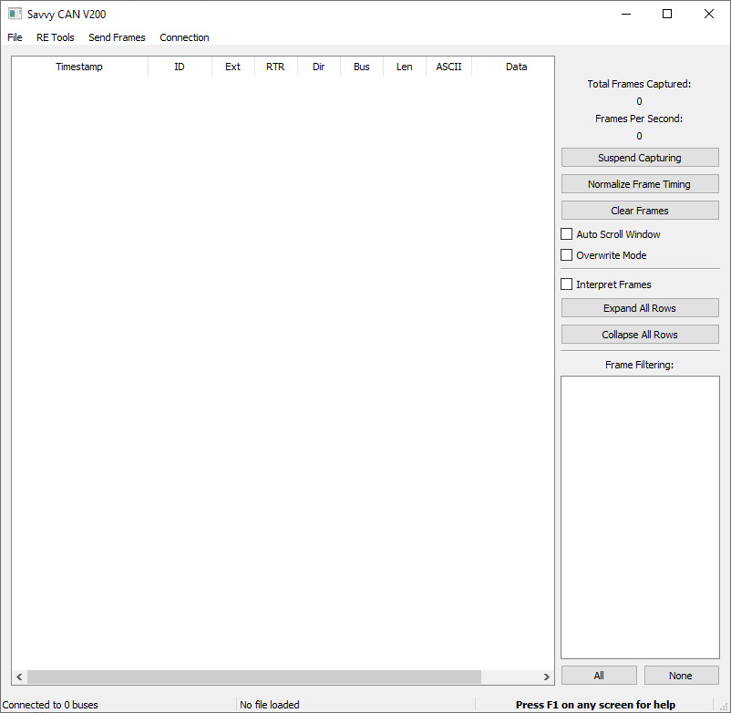
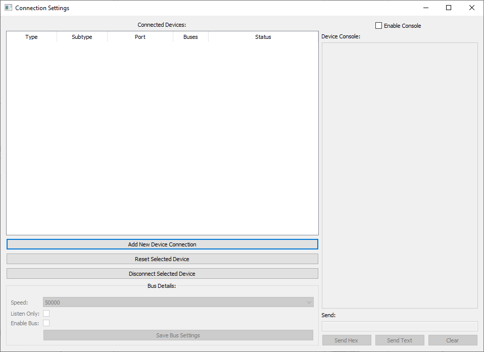
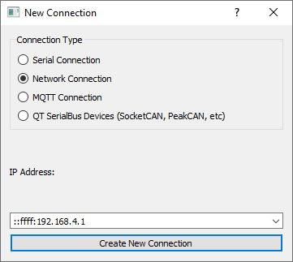
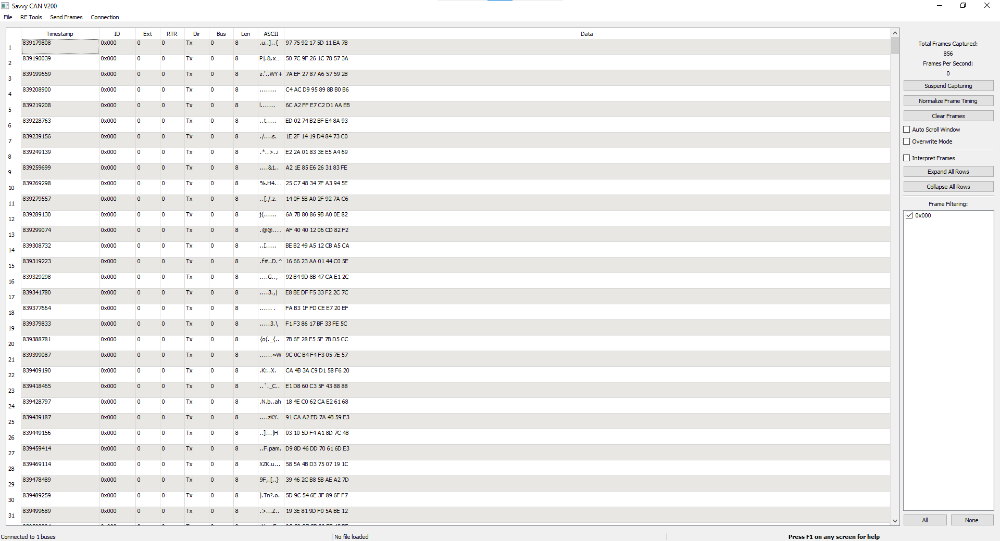

# Getting Started with A0

## Intro

#### What is A0RET?

A0RET is the name of the firmware that comes pre-loaded on your new Macchina A0. A0RET stands for A0 Reverse Engineering Tool and provides two primary functionalities\*: ELM327 emulation for use with apps like Torque, and Wi-Fi based connection to SavvyCAN.

_\*These functionalities are current as of version 0.1, however future versions may have expanded features._

#### ELM327 Emulation, Explained Extra Efficiently 

Why would you want to emulate an ELM327 device? First off, ELM327 is a closed-source black box interpreter chip \(a PIC with some firmware\) and you'd much rather know exactly what is being sent to and from your car, right?

Another answer is that now you can take advantage of the numerous existing, \(semi\) working and tested applications out there for every platform.

#### Smartphone Apps

Torque Lite for Android can be found at the link below:



An iOS alternative is also included below:



#### Other Software



## Flash A0RET to your A0 \(again!\)


A0 comes pre-loaded with A0RET, no need to flash again unless you've been flashing new programs to your A0!


#### Download A0RET

Find the A0RET repo at the link below: Download the entire repo as a .zip and extract to a folder called A0RET. Open A0RET.ino with Arduino IDE. 



#### Enable Bluetooth

On line 80 of A0RET.ino, change false to true to enable Bluetooth by default \(for connecting with Torque\).

#### Upload Settings

Ensure your settings match those shown below before uploading. \(These should all be correct by default except for Partition Scheme\)

## Use A0 with Torque

The process of connecting A0 with non-Torque apps should be fairly similar to the the one shown below.

#### Connect via Bluetooth

Using your phone's Bluetooth settings, connect to ELM327-A0.

#### Configure Torque

Enter the settings in Torque, and then the "OBD2 Adapter Settings". Ensure connection type is set to Bluetooth and then select ELM327-A0 under the "Choose Bluetooth Device" option.

#### 

#### Done!

After this point consult the [**Torque Wiki**](https://torque-bhp.com/wiki/Main_Page) to learn how to use Torque.

## Use A0 with SavvyCAN

A0RET allows A0 to work with SavvyCAN via Wi-Fi, no wires needed!

#### Download SavvyCAN

Follow the link below to download the latest release\* of SavvyCAN as a zip archive. Then unzip to a folder.

_\*As of the date of this guide, this version is 1.0.36._



#### Run SavvyCAN

First run vc\_redist.x64.exe to install the Microsoft Visual C++ Redistributable, then run SavvyCAN.exe to open SavvyCAN.

#### Add a Connection

Go to Connection-&gt;Open Connection Window to begin adding a new device.

At this point, from the machine running SavvyCAN, power on A0 and connect to its Wi-Fi network. The defaults are:

**SSID:** ESP32SSID

**Password:** aBigSecret


These defaults can be changed on lines 89 and 94 of A0RET.ino


Click Add New Device Connection and select Network Connection, the IP address should pre-populate since we have already connected to A0's network.

#### Test the Connection


This should be done while A0 is powered on but not connected to a vehicle, such as through the USB cable.


Go to Send Frames-&gt;Fuzzing, click start fuzzing and then stop fuzzing to send random CAN frames.

Back in the main window, the frames sent by fuzzing should be listed.

#### View CAN Traffic in a Vehicle!

After this step you're ready to move your A0 to a vehicle and connect to it using the same steps as above \(you may want to enable Listen Only to avoid any accidents at first\). The A0-specific steps have now all been completed and you have free reign in the huge playground that is SavvyCAN, visit their extensive documentation below:



