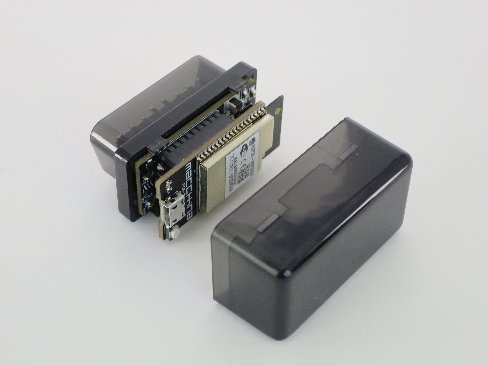

# Installation

The Macchina A0 was designed with a convenient under-the-dash form factor that plugs directly into the OBD2 port of any modern car. 

## Plug it in under your dash. That's it.

A0 plugs directly into the OBD2 port of the modern car. Any car built after 1996 has an OBD2 port near the steering wheel, under the dash.

## A0 OBD2 connector pinout

The OBD2 connector is a 16 pin connector that provides power and a data connection. The image below shows the pin orientation of this 16 pin connector.

This following table describes the functionality of each pin. Please note that A0 only supports a single channel of CAN \(CAN0\), the rest of the pins are provided for general reference.

## THIS IS ALL VERIFIED TO BE TRUE OF A0 \(DELETE THIS\)

| Pin | Schematic name | function |
| :--- | :--- | :--- |
| 1 | SWC\_BUS | Single Wire CAN |
| 2 | J1850+\_BUS | J1850 + BUS |
| 3 | MSC\_BUS+ | CAN1 HIGH |
| 4 | CHASSIS | CHASSIS GND |
| 5 | DGND | Digital GND |
| 6 | HSC\_BUS+ | CAN0 HIGH |
| 7 | 9141\_K\_BUS | K-LINE or LIN channel 1 |
| 8 | TP2\_NET | Test Point |
| 9 | TP1\_NET | Test Point |
| 10 | J1850-\_BUS | J1850 - BUS |
| 11 | MSC\_BUS- | CAN1 LOW |
| 12 | TP3\_NET | Test Point |
| 13 | TP4\_NET | Test Point |
| 14 | HSC\_BUS- | CAN0 LOW |
| 15 | 9141\_L\_BUS | L-LINE or LIN channel 2 |
| 16 | VIN | +12V INPUT |

