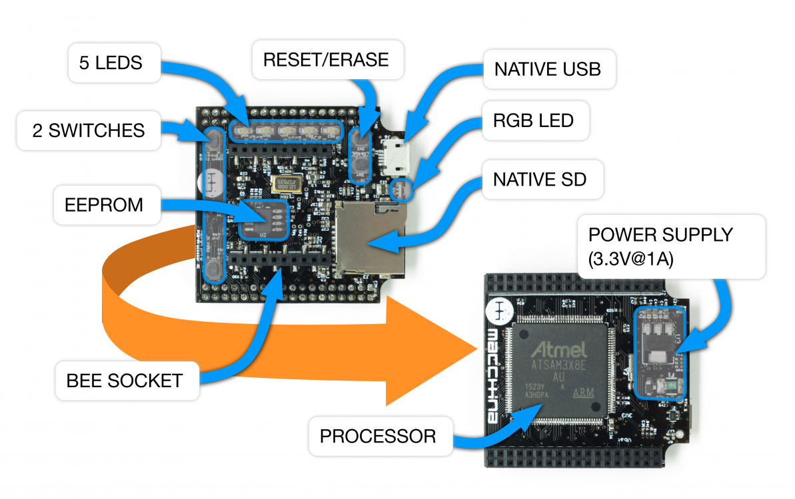

# Processor

The processor board of M2 contains the brains and the communication circuitry. It features 6 LEDs \(5 one-color and 1 RGB LED\), 4 switches \(2 user switches, RESET and ERASE\), an EEPROM, an SD car socket, a Native USB port \(that can act as both a USB device or host\), and a XBee form factor socket,

M2 uses the same processor as the Arduino Due.

More information, including original Due schematics found here: [https://www.arduino.cc/en/Main/ArduinoBoardDue](https://www.arduino.cc/en/Main/ArduinoBoardDue)

Here is the link to the datasheet: [http://www.atmel.com/Images/Atmel-11057-32-bit-Cortex-M3-Microcontroller-SAM3X-SAM3A\_Datasheet.pdf](http://www.atmel.com/Images/Atmel-11057-32-bit-Cortex-M3-Microcontroller-SAM3X-SAM3A_Datasheet.pdf)

