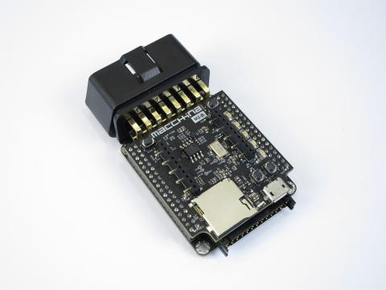

# About M2

The Macchina M2 was in development for years prior to its release and the team behind it has been working together on other projects for much longer. Building the M2 has always been a goal of ours. Our [crowdfunding campaign](https://www.kickstarter.com/projects/1029808658/macchina-the-ultimate-tool-for-taking-control-of-y) was the catalyst that transformed us from friends and an idea to a company and a product. We are very thankful to everyone who enabled this transformation. We repay you through our hard work and dedication to this project.

We would also like to thank the organizations that have helped build the communities that the M2 relies on: [Arduino](https://www.arduino.cc/), [DIGI International](https://www.digi.com/), [Digi-Key](https://www.digikey.com/), the [EFF](https://www.eff.org/), [Hackaday](http://hackaday.com/), and [Open Garages](http://opengarages.org/). Finally, to the developers who spend their own time building essential tools, answering questions on the forum, and testing, thank you.

## Device Summary

M2 by Macchina is an open and versatile automotive interface that can take your car to the next level. Use it to customize your ride or as a development platform for your next product. M2 works with almost any vehicle and features an SAM3X ARM Cortex-M3 processor at its core---the same processor as the Arduino Due. An XBee form factor socket allows for many wireless capabilities.

You can ead more about M2 general features [on our website](https://www.macchina.cc/m2-introduction).

## Goals

As we developed the Macchina M2, we set out with the following goals:

* Help foster a new generation of car nerds
* Develop an innovative product for a wide range of automotive functions
* Support the DIY and Open Source ecosystem
* Provide companies with a great tool for fast prototyping
* Display our ability to develop and mass produce quality hardware

## Specification

The M2 is an open source automotive interface that takes the form of an OBD2 "under-the-Dash" dongle or hard-wired "under-the-hood" device. Each M2 has all the interface circuitry needed to connect to the 5+ standard OBD2 protocols plus other interfaces such as a second CAN bus, LIN bus, and single-wire CAN. It also includes several options for connections to the outside world including: SD card, USB Device and Host, 20-pin \(sort of standard\) XBee socket, and a general purpose connector.

We designed the M2 to be modular and the result was three main related, but independent, components.

The **M2 Interface Board** provides most of the hardware support for automotive connections. The goal was for M2 to be able to interface and communicate with as many cars as possible. We crammed 2 channels of CAN, 2 channels of LIN/K-LINE, a J1850 VPW/PWM and even a single-wire CAN \(GMLAN\) interface onto the board. Automotive environments require the M2 to be seriously strong, so we built in plenty of protection circuitry. Lastly, we have 6 general purpose driver circuits, which can source and sink up to 1 amp of current at 12 volts!

The **M2 Processor Board** is the standard computing engine for the Macchina M2. We chose the Arduino Due as the basis of M2's processor board. Shrinking the Due by well over 50% was no small task! We decided to make further improvements by using the High Speed SD card interface and writing the appropriate firmware libraries to allow for faster data logging. We also added several LED options and a couple switches for a more pleasant development experience. Lastly, we tacked on an EEPROM to store variables after power is cut to M2. The processor BCB can be swapped with a [Breakout Board](detailed-reference/byob.md) to more easily use the M2 Interface Board with your choice of processor.

A **wireless socket** on the M2 Processor Board accommodates a wide variety of wireless options using the popular DIGI XBee form factor socket. Many inexpensive, plug-and-play boards already exist including BLE, WIFI, GSM, 3G, LTE, GPS and others. This can even be used to reprogram the M2 wirelessly.

