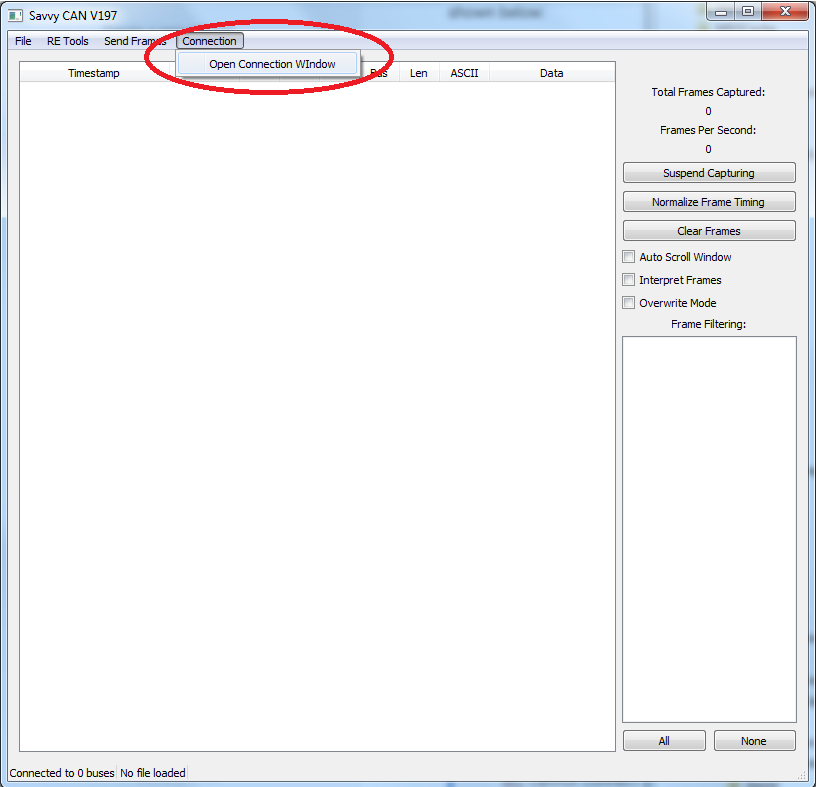
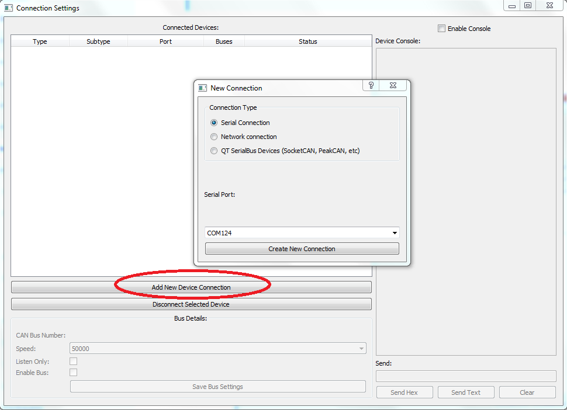
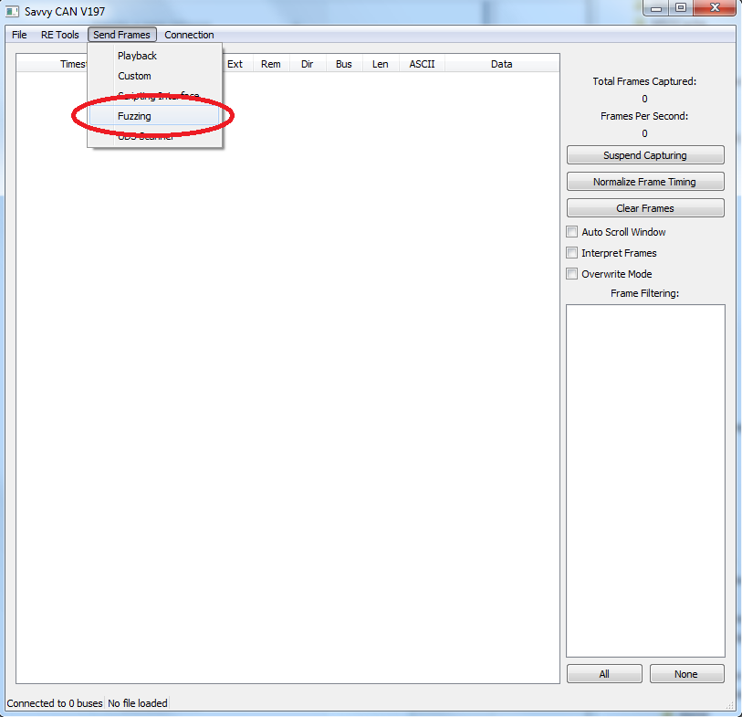
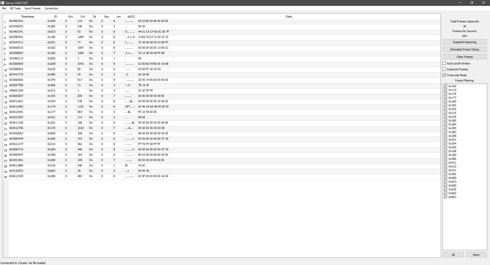

# M2 and SavvyCAN, the Basics

Hardware Needed

* [Macchina M2](https://www.macchina.cc/catalog/m2-boards/m2-under-dash)
* [USB Cable \(The longer the better\)](https://www.macchina.cc/catalog/cables/usb-micro-b-20-cable-5-pin-2824awg-gold-plated-black-15ft)
* Laptop
* Test Vehicle

## Flash M2 with M2RET

M2RET must be flashed to M2 to forward messages from the car to the computer and vice versa.

The easiest way to install M2RET is by downloading the M2RET firmware updater from the SavvyCAN website, the updater can be found [here.](http://www.savvycan.com/M2RET_Flash.zip)

Extract "M2RET\_FLASH.zip" and follow the instructions in the "HOWTO.txt" file relevant to your operating system. \(Make sure M2 is plugged in and any existing serial connections to it are closed\) Screenshots are shown below:















## Connect M2 with SavvyCAN

Download the SavvyCAN version appropriate for your operating system [here.](http://www.savvycan.com/)


Disconnecting and reconnecting M2 to the computer after flashing can fix some issues where M2 cannot connect to SavvyCAN


* **1\)** Open the connection window.

* **2\)** Click "Add New Device Connection" and create a new serial connection with the relevant port.

* **3\)** Test the connection by opening Send Frames&gt;Fuzzing. Click "Start Fuzzing".

## Use M2 and SavvyCAN on a Vehicle


Always be safe when working on or around vehicles and use common sense.


* **1\)** Now close the fuzzing window and plug M2 into the OBDII port of a turned off vehicle. SavvyCAN will begin displaying the CAN frames received from the vehicle.

* **2\)** Now try starting the vehicle and observe the increase in CAN traffic. \(For a more coherent view try checking the "Overwrite Mode" box\)

* **3\)** In addition to enabling "Overwrite Mode", individual frames can be filtered by ID using the check boxes on the right side of the screen. This can be useful for determining which IDs are associated with certain actions in the car.


For more information on using SavvyCAN, try [the SavvyCAN docs](http://www.savvycan.com/docs/), [Collin Kidder's YouTube channel](https://www.youtube.com/user/CKidder80), or [the Macchina forums](https://forum.macchina.cc/).


