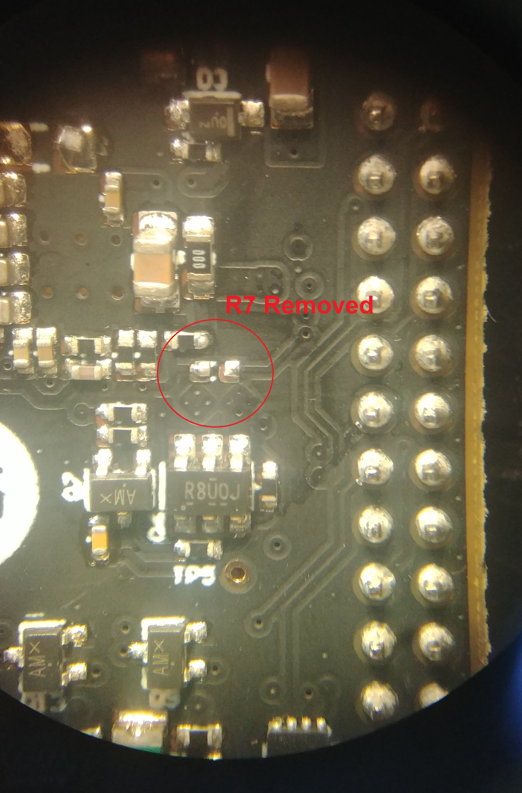

# Power Supply Note

P1 contains a "Synchronous Step-Down Converter" \([TPS54328](https://www.ti.com/lit/ds/symlink/tps54328.pdf?ts=1593196956435&ref_url=https%253A%252F%252Fwww.google.com%252F)\) whose purpose is to convert the vehicle voltage from the OBD-II port \(12+ V\) to 5 V for use by the PocketBeagle. This converter's enable pin was originally connected to a pin on PocketBeagle that floats when the device is powered off. The result is an unpredictable state on the enable pin which results in the P1 not reliably powering on through the OBD-II connector. This issue is limited to situations where power is only supplied through the OBD-II connector, powering through the USB connector should be unaffected.

The currently implemented solution is the removal of the R7 resistor which connects the enable pin to PocketBeagle, which means the converter will always power on. **P1 is shipped with this fix in place.**

