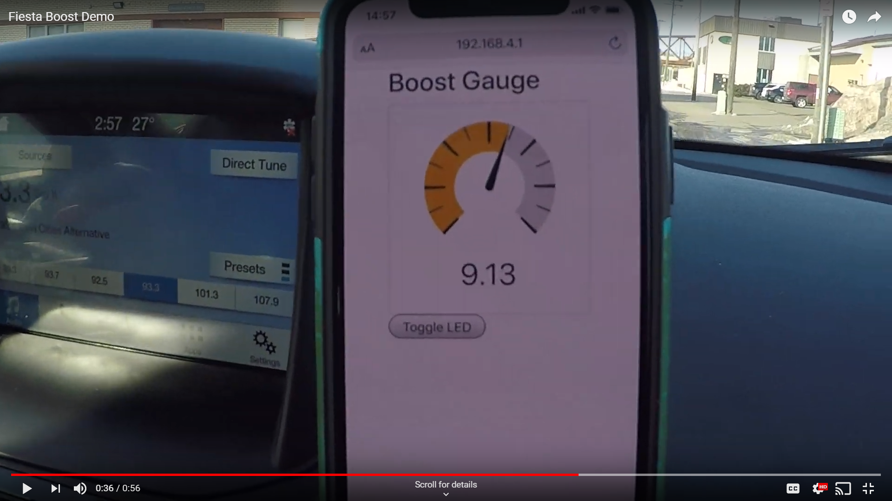

# Work-in-Progress A0 projects

Below are longer-term projects specific to A0. The goal here is to help you get started and get inspired! These are community-developed, open source projects, so we encourage you to get involved.


For basic tutorials, check out our mini tutorial section including several A0 specific projects:

[projects/mini-project-tutorials](../mini-project-tutorials/)


## A0 as a Webserver - a digital dashboard! ⏲🎛

With the right code, A0 can be a WIFI access point hosting a webpage - not just some boring static website, but a fully dynamic, interactive website where any browser \(laptop, tablet, cell phone\) can be your digital dashboard!

At the heart of A0 is the powerful ESP32 microcontroller capable of interacting with the car via CAN and be a fully functional WIFI access point at the same time. You connect your phone to the A0 access point, pull up a browser and start interacting with your car. 

In this demo, we are displaying Boost pressure in a sweet 2016 Ford Fusion by reading the Intake MAP value via OBD2 commands, subtracting the ambient pressure \(hard-coded to whatever it was here in MN during our test\) and spitting out websocket messages at 20Hz. We're also demonstrating how to send data to the A0 to toggle an LED via a button press on the phone.

This demo was hacked together starting with this project as a reference:

[https://shawnhymel.com/1882/how-to-create-a-web-server-with-websockets-using-an-esp32-in-arduino/](https://shawnhymel.com/1882/how-to-create-a-web-server-with-websockets-using-an-esp32-in-arduino/)

The webpage hosted on the ESP32 has a gauge.js instance running and a Bootstrap CSS framework. To add more gauges, we'd need to start using JSON messages \(or something similar\) to update more than one gauge. 

Here is the code we used in this demo: 



### Next steps:

This demo shows a basic implementation of how to use websockets to display a single gauge on a browser.  Next step would be to add more gauges, line graphs, and improve user interface.


Get in touch if you want to help take this project forward!


## AWS integration 🕸 

Put your data in the cloud. We'll be posting more information here about some cloud projects. 

## Other Projects ideas:

1. BLE beacon 
2. Bluetooth to phone connection.
3. [OBD-II emulation on ESP32 ](https://hackaday.com/2018/04/11/emulating-obd-ii-on-the-esp32/)

