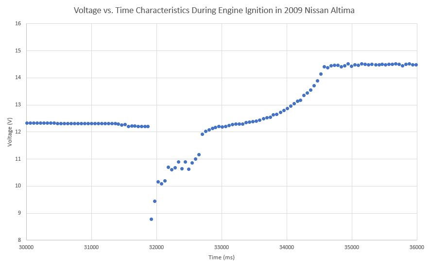

# Help Collect Voltage Data

Many people have done it before or known someone who's done it: leaving your headlights on and coming back to a dead battery. When developing electronic devices for cars a similar problem can occur with high power devices such as cellular modems. Therefore it would be advantageous to keep the high power devices off until the car is turned on, which raises the question, how can we tell when the car is turned on?

We've started a little project to collect voltage measurements before, during and after a car engine is running. Click here to learn more and contribute:&#x20;



Here is a sample of the voltage levels during the 3 stages of starting a car: &#x20;

