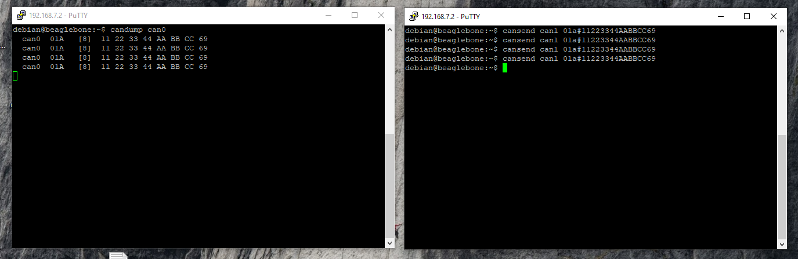

# P1 CAN Loopback

#### Items Used

* 1x [P1](https://www.macchina.cc/catalog/p1-boards/p1-under-dash)
* 1x [OBD3way board](https://www.macchina.cc/catalog/tools/obd3way)
* 1x 12V power supply

#### OBD3way Setup

CAN0H to CAN1H and CAN0L to CAN1L and place a termination resistor across these connections; see photos below for setup. 


#### Test

Once everything is hooked up, we power up P1, and SSH into P1 in two windows at: 192.168.7.2 to control each CAN channel at the same time. 



Below you can see each session. Note that you'll want to send the "candump ..." command before sending the "cansend ..." command in the other window. 



```text
login as: debian
Pre-authentication banner message from server:
| Debian GNU/Linux 9
|
| BeagleBoard.org Debian Image 2019-08-03
|
| Support/FAQ: http://elinux.org/Beagleboard:BeagleBoneBlack_Debian
|
| default username:password is [debian:temppwd]
|
End of banner message from server
debian@192.168.7.2's password:

The programs included with the Debian GNU/Linux system are free software;
the exact distribution terms for each program are described in the
individual files in /usr/share/doc/*/copyright.

Debian GNU/Linux comes with ABSOLUTELY NO WARRANTY, to the extent
permitted by applicable law.
debian@beaglebone:~$ sudo ip link set can0 type can bitrate 250000
[sudo] password for debian:
debian@beaglebone:~$ sudo ifconfig can0 up
debian@beaglebone:~$ candump can0
  can0  01A   [8]  11 22 33 44 AA BB CC DD
  can0  01A   [8]  11 22 33 44 AA BB CC DD
  can0  01A   [8]  11 22 33 44 AA BB CC DD
  can0  01A   [8]  11 22 33 44 AA BB CC DD
  can0  01A   [8]  11 22 33 44 AA BB CC DD
  can0  01A   [8]  11 22 33 44 AA BB CC DD
  can0  01A   [8]  11 22 33 44 AA BB CC DD
  can0  01A   [8]  11 22 33 44 AA BB CC DD
  can0  01A   [8]  11 22 33 44 AA BB CC DD
  can0  01A   [8]  11 22 33 44 AA BB CC DD
  can0  01A   [8]  11 22 33 44 AA BB CC DD
  can0  01A   [8]  11 22 33 44 AA BB CC DD
^Cdebian@beaglebone:~cansend can0 01a#11223344AABBCCDD
debian@beaglebone:~$ cansend can0 01a#11223344AABBCCDD
debian@beaglebone:~$ cansend can0 01a#11223344AABBCCDD
debian@beaglebone:~$ cansend can0 01a#11223344AABBCCDD
debian@beaglebone:~$ cansend can0 01a#11223344AABBCCDD
debian@beaglebone:~$ cansend can0 01a#11223344AABBCCDD
debian@beaglebone:~$ cansend can0 01a#11223344AABBCCDD
debian@beaglebone:~$ cansend can0 01a#11223344AABBCCDD
debian@beaglebone:~$ cansend can0 01a#11223344AABBCCDD
debian@beaglebone:~$ cansend can0 01a#11223344AABBCCDD
debian@beaglebone:~$
```



```
login as: debian
Pre-authentication banner message from server:
| Debian GNU/Linux 9
|
| BeagleBoard.org Debian Image 2019-08-03
|
| Support/FAQ: http://elinux.org/Beagleboard:BeagleBoneBlack_Debian
|
| default username:password is [debian:temppwd]
|
End of banner message from server
debian@192.168.7.2's password:

The programs included with the Debian GNU/Linux system are free software;
the exact distribution terms for each program are described in the
individual files in /usr/share/doc/*/copyright.

Debian GNU/Linux comes with ABSOLUTELY NO WARRANTY, to the extent
permitted by applicable law.
debian@beaglebone:~$ sudo ip link set can1 type can bitrate 250000
[sudo] password for debian:
debian@beaglebone:~$ sudo ifconfig can1 up
debian@beaglebone:~$ cansend can1 01a#11223344AABBCCDD
debian@beaglebone:~$ cansend can1 01a#11223344AABBCCDD
debian@beaglebone:~$ cansend can1 01a#11223344AABBCCDD
debian@beaglebone:~$ cansend can1 01a#11223344AABBCCDD
debian@beaglebone:~$ cansend can1 01a#11223344AABBCCDD
debian@beaglebone:~$ cansend can1 01a#11223344AABBCCDD
debian@beaglebone:~$ cansend can1 01a#11223344AABBCCDD
debian@beaglebone:~$ cansend can1 01a#11223344AABBCCDD
debian@beaglebone:~$ cansend can1 01a#11223344AABBCCDD
debian@beaglebone:~$ cansend can1 01a#11223344AABBCCDD
debian@beaglebone:~$ cansend can1 01a#11223344AABBCCDD
debian@beaglebone:~$ cansend can1 01a#11223344AABBCCDD
debian@beaglebone:~$ candump can1
  can1  01A   [8]  11 22 33 44 AA BB CC DD
  can1  01A   [8]  11 22 33 44 AA BB CC DD
  can1  01A   [8]  11 22 33 44 AA BB CC DD
  can1  01A   [8]  11 22 33 44 AA BB CC DD
  can1  01A   [8]  11 22 33 44 AA BB CC DD
  can1  01A   [8]  11 22 33 44 AA BB CC DD
  can1  01A   [8]  11 22 33 44 AA BB CC DD
  can1  01A   [8]  11 22 33 44 AA BB CC DD
  can1  01A   [8]  11 22 33 44 AA BB CC DD
  can1  01A   [8]  11 22 33 44 AA BB CC DD

```



