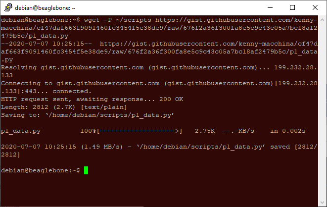
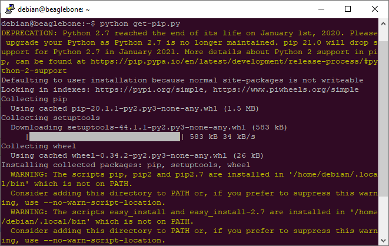
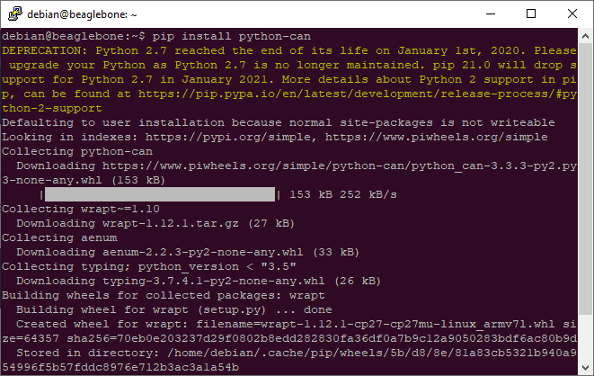
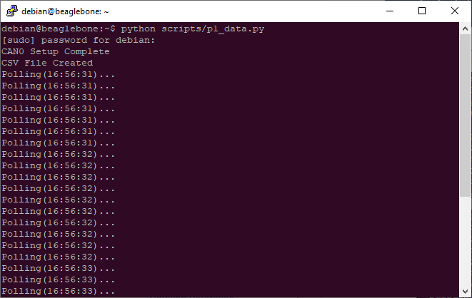
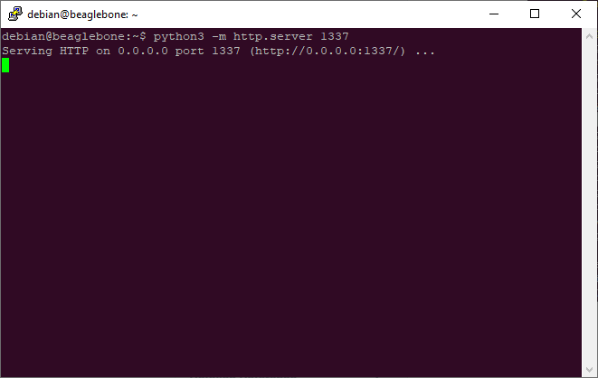
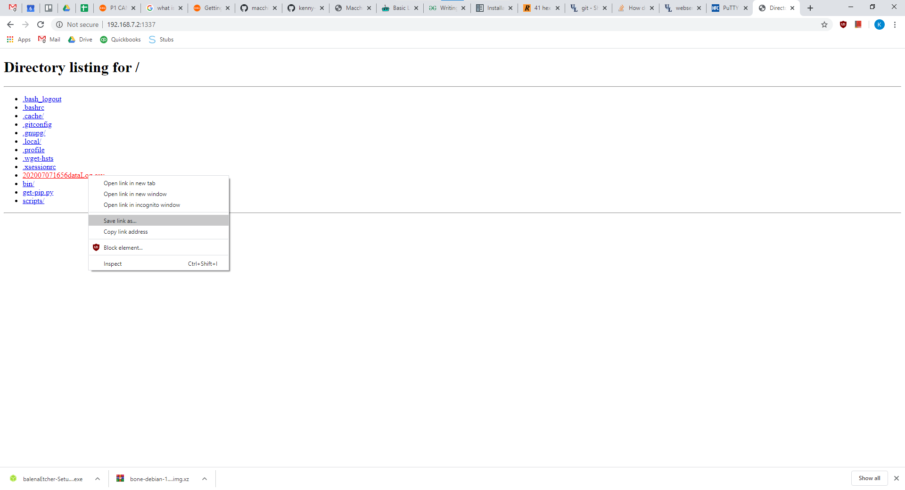
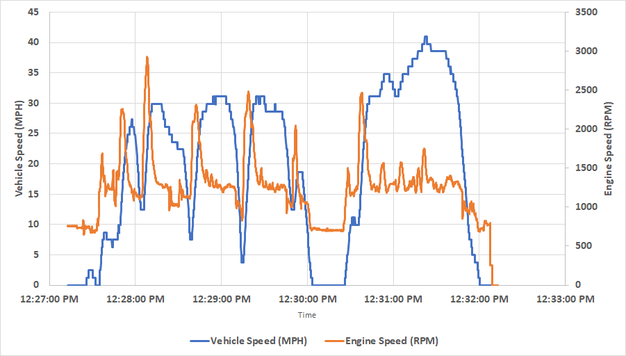
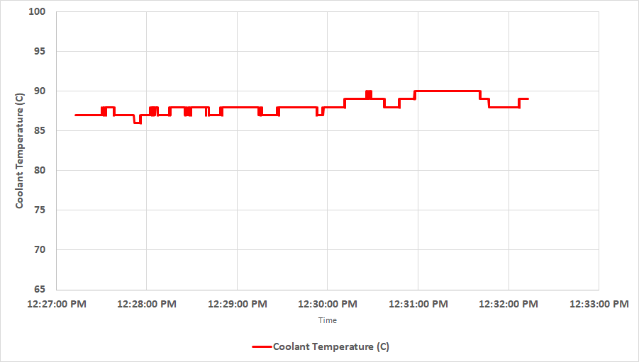

# P1 CAN Vehicle Data

#### Items Used

* 1x [P1](https://www.macchina.cc/catalog/p1-boards/p1-under-dash)
* 1x Car with OBD-II port

#### Download P1 Vehicle Data Python Program

After connecting to P1 via SSH, run the command below to download the python program and save it to ~/scripts. \(If using putty to SSH, just right click to paste!\)

```text
wget -P ~/scripts https://gist.githubusercontent.com/kenny-macchina/cf47daf663f9091460fc3454f5e38de9/raw/676f2a36f300fa8e5c9c43c05a7bc18af2479b5c/p1_data.py
```



#### Install Pip

Run the commands below to install the "Pip" package manager and reboot.

```text
curl https://bootstrap.pypa.io/get-pip.py -o get-pip.py
python get-pip.py
sudo reboot now
```



#### Install Python-CAN Library

Run the commands below to install the python-can library and reboot.

```text
pip install python-can
sudo reboot now
```



#### Collecting Data

First, start your car, then plug P1 into the OBD-II port and run the data collection program using the command below. \(Make sure you're in the home directory beforehand by running the command "cd".\) P1 will prompt for a password as the program sets up the CAN0 bus. After entering the password data collection will begin until the program is halted by pressing CTRL-C.

```text
python scripts/p1_data.py
```



#### Retrieving Data

To download the CSV file from P1, the command below can be used to host an HTTP server on the port specified, this can then be visited in a web browser \(from a computer on the same LAN\) and the file\(s\) downloaded.

```text
python3 -m http.server 1337
```





#### Example Results





