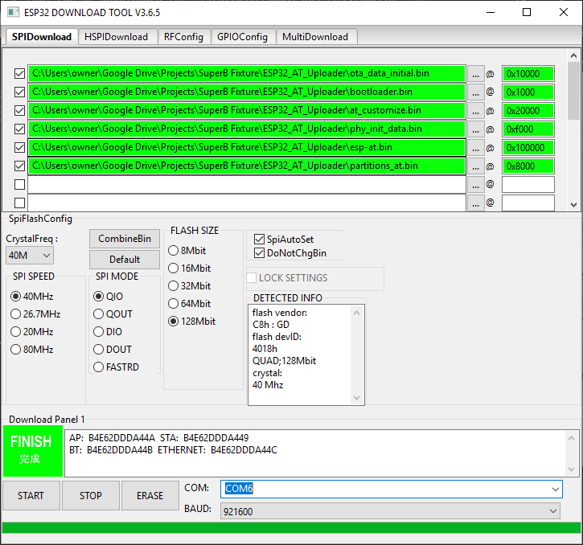

# Sending AT Commands

* **1\)** First, follow the instructions [here](flashing-superb.md) to flash SuperB with the ESP tool.
* **2\)** Follow the instructions [here](https://github.com/espressif/arduino-esp32/blob/master/docs/arduino-ide/boards_manager.md) to set up the board manager for ESP32.
* **3\)** Connect the SuperB with the USB adapter board and select the correct port.
* **4\)** Open the serial monitor, with baud equal to 115200 and both NL and CR set.


* **5\)** Hit RESET on the USB adapter board, the SuperB should report back ready.



 Try the following two commands sequentially to get a list of access points visible to the SuperB:

```text
 AT+CWMODE=3
 AT+CWLAP
```


For a full list of available AT commands click [here.](https://www.espressif.com/sites/default/files/documentation/esp32_at_instruction_set_and_examples_en.pdf)

