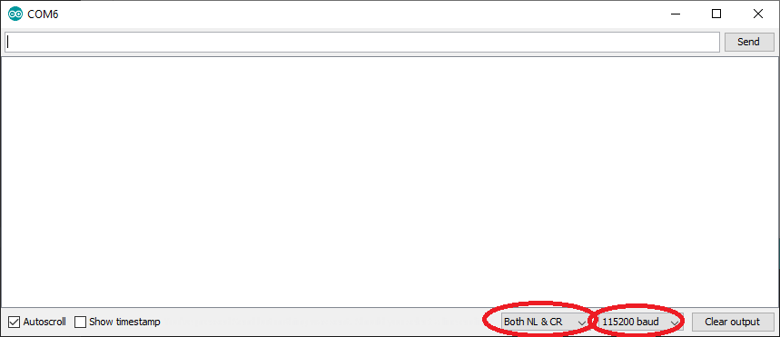

# Using ESP Tool

The ESP tool "Flash Download Tools \(ESP8266 & ESP32\)" can be downloaded [here.](https://www.espressif.com/en/support/download/other-tools)  
The binary files used can be downloaded [here.](https://github.com/macchina/docs/raw/master/superB/flashing/ESP32_AT_Uploader.zip) \(Right click&gt;Save link as\)

1. Open the tool and select "ESP32 DownloadTool".

   

2. Enter the binary files and their addresses, and configure the remaining settings as shown below, selecting the corresponding COM port.

   

3. Place the SuperB into bootloader mode by holding down the BOOT button, pressing and releasing the RESET button, and then releasing the BOOT button.
4. Press start to begin flashing. \(~10sec\)

