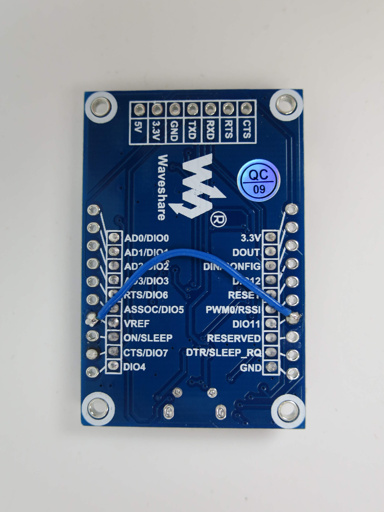
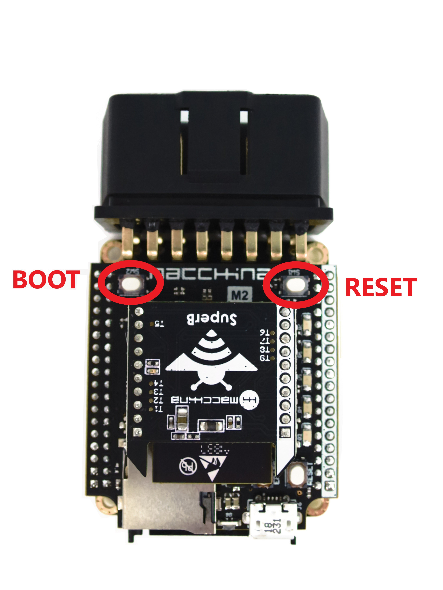

# Flashing SuperB

## Overview

SuperB can be flashed using an XBee USB adapter board or using M2.



For the instructions that follow, the SuperB is connected to the computer with an XBee USB Adapter board \(with one modification\), available [here.](https://www.amazon.com/XBee-USB-Adapter-Communication-Connectivity/dp/B017KGBP6Y)


Before the board can be used with the SuperB, VREF and DIO11 need to be bridged on the rear of the board as shown below.



At this point the board can be connected to the computer via USB with the RESET and BOOT buttons controlling EN and IO0, respectively.







* **1\)** Follow the instructions [here](https://github.com/espressif/arduino-esp32/blob/master/docs/arduino-ide/boards_manager.md) to set up the board manager for ESP32.
* **2\)** Modify the file "platform.txt" found at: C:\Users\*_YourUsername\*_\AppData\Local\Arduino15\packages\esp32\hardware\esp32\1.0.2\platform.txt

  Replace "default\_reset" with "no\_reset" once on line 100 and once on line 101.

* **3\)** Replace the file "boards.txt" found at:

  C:\Users\*_YourUsername\*_\AppData\Local\Arduino15\packages\esp32\hardware\esp32\1.0.2\boards.txt

  Replace the existing "boards.txt" file with the one available [here.](https://github.com/kenny-macchina/docs/tree/306ccc81a873f9c8cfe2e05a0cbffb8ff395906b/superB/flashing/boards.txt)

* **4\)** Restart the IDE.
* **5\)** Plug SuperB into M2 with the antenna trace/U.FL connector towards the USB port and then plug M2 into computer. \(Note the button nomenclature and board orientation\)  



* **6\)** Select "Macchina M2" as board type and upload the sketch below:  



```cpp
int buttonState1 = 0;
int buttonState2 = 0;


 void setup() {
 pinMode(DS2, OUTPUT);
 pinMode(DS3, OUTPUT);
 pinMode(XBEE_RST, OUTPUT);
 pinMode(XBEE_MULT4, OUTPUT);
 pinMode(Button1, INPUT);
 pinMode(Button2, INPUT);
 SerialUSB.begin(115200);
 Serial.begin(115200);
 }

 char rx_byte = 0;

 void loop() {
 if (SerialUSB.available() > 0) {
     rx_byte = SerialUSB.read();
     Serial.write(rx_byte);
 }
 if (Serial.available() > 0) {
     rx_byte = Serial.read();
     SerialUSB.write(rx_byte);
 }

 buttonState1 = digitalRead(Button1);

 if (buttonState1 == LOW) {
     digitalWrite(DS2, LOW);
     digitalWrite(XBEE_RST, LOW);
 } else {
     digitalWrite(DS2, HIGH);
     digitalWrite(XBEE_RST, HIGH);
 }

 buttonState2 = digitalRead(Button2);

 if (buttonState2 == LOW) {
     digitalWrite(DS3, LOW);
     digitalWrite(XBEE_MULT4, LOW);
 } else {
     digitalWrite(DS3, HIGH);
     digitalWrite(XBEE_MULT4, HIGH);
 }
 }
```



* **7\)** Open the serial monitor. Place the SuperB into bootloader mode by holding down the   BOOT \(SW2\) button, pressing and releasing the RESET \(SW1\) button, and then releasing the BOOT \(SW2\) button. The serial monitor output should look like the one below:


* **8\)** Select "SuperB on M2" as board type:


* **9\)** A good example sketch can be found in File&gt;Examples&gt;Examples for SuperB on M2&gt;WiFi&gt;WiFiScan. Upload it.
* **10\)** Close and reopen the serial monitor with "Macchina M2" as the board type. Press RESET \(SW1\) to begin scanning for access points:






