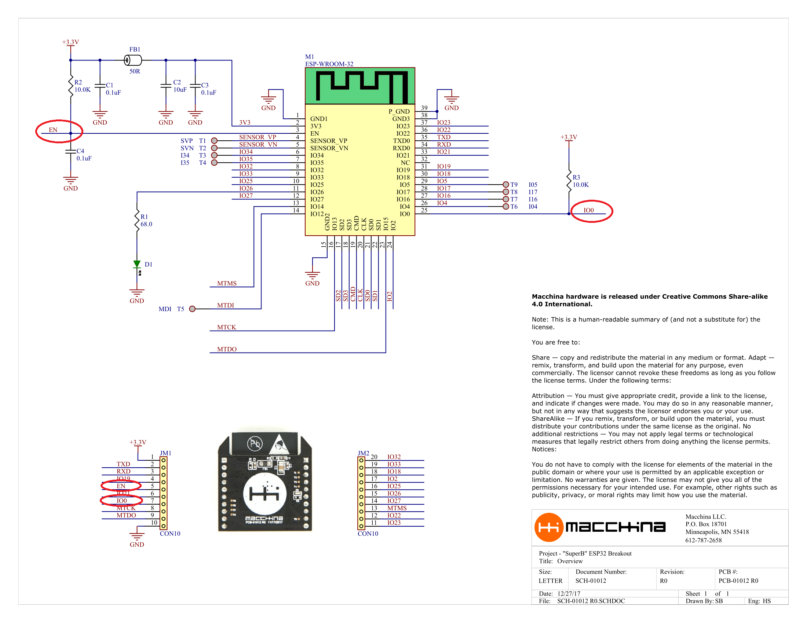

# Hardware

## The SuperB Hardware

  
\(The SuperB breakout overview, take note of the locations of "EN" and "IO0"\)

To place SuperB into bootloader mode, EN must be brought low and returned to high while IO0 is held low. Or, in other words, IO0 must be held low during the EN rising edge. \(See depiction below\)  

## Use XBee USB Adapter to Flash

For the instructions that follow, the SuperB is connected to the computer with an XBee USB Adapter board \(with one modification\), available [here.](https://www.amazon.com/XBee-USB-Adapter-Communication-Connectivity/dp/B017KGBP6Y)  
  
Before the board can be used with the SuperB, VREF and DIO11 need to be bridged on the rear of the board as shown below.  
  
At this point the board can be connected to the computer via USB with the RESET and BOOT buttons controlling EN and IO0, respectively.  

## Flashing

* Flash with USB Adapter Board
  * [Flash with the ESP Tool](flashing-superb-with-usb-adapter-board/esp.md)  
  * [Flash with the Arduino IDE](flashing-superb-with-usb-adapter-board/arduino.md)
* Flash with M2
  * [Flash with the Arduino IDE](flashing-superb-with-m2/arduinom2.md)

